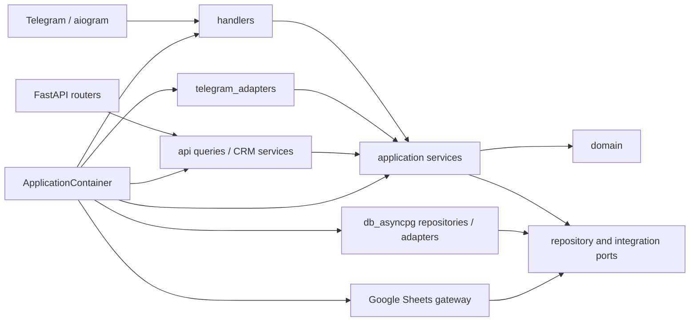
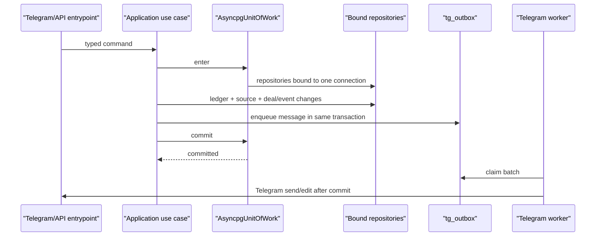

# Backend Architecture

Этот документ описывает текущее устройство backend после этапов R0-R8. Целевой
roadmap CRM находится в `workflow_crm.md`, история рефакторинга — в
`refactoring.md`. При расхождении описания с кодом источником истины являются
архитектурные тесты и composition root.

## Основные правила

- Telegram bot и FastAPI — независимые входные адаптеры над общими application
  services.
- Бизнес-правила и domain models не зависят от aiogram, FastAPI, asyncpg или Google
  SDK.
- Все runtime-зависимости собирает `ApplicationContainer`; handlers и routers не
  создают application services.
- PostgreSQL pool создаётся bootstrap-слоем и явно передаётся repositories и UoW.
- Связанные денежные, source, deal/event и outbox изменения фиксируются одной
  транзакцией.
- Telegram I/O после commit выполняется через `tg_outbox` worker.
- Публичный API Python-пакета ограничен его `__all__`; внутренние DTO, policies и
  adapters импортируются из модулей-владельцев.

## Слои и зависимости



Разрешённое направление зависимостей:

1. `domain` содержит value objects, deal/source models, policies и domain errors.
2. `services` содержит use cases и узкие `Protocol`-порты.
3. `api/queries` содержит read-side orchestration; `api/presentation` преобразует
   read/domain models в transport schemas.
4. `db_asyncpg/repositories` и `db_asyncpg/adapters` реализуют persistence ports.
5. `handlers`, `api/routers` и `telegram_adapters` владеют transport-specific кодом.
6. `app` и bootstrap entrypoints могут зависеть от всех слоёв для сборки object
   graph, но не содержат бизнес-правил.

Application-код не должен импортировать `handlers`, `keyboards`,
`telegram_adapters`, aiogram или FastAPI. Domain не импортирует infrastructure и
transport. Эти ограничения закреплены в `tests/unit/test_architecture_boundaries.py`.

## Composition Root

`app/container.py` — единственный владелец основного object graph:

- `OperationalRepositories` предоставляет узкие repository views для bot use cases;
- `CrmRepositories` собирает CRM read/write repositories и outbox;
- `CrmServices` содержит deal/event/source-mutation services;
- `ApiQueryServices` содержит read-only queries;
- `CashServices` и `ExchangeServices` группируют bounded-context services;
- `ApplicationContainer` публикует готовые зависимости обоим входным адаптерам.

`BotApp` применяет миграции, создаёт pool, container, handlers и опциональный uvicorn
server. Отдельный `python -m api.run` использует тот же `ApplicationContainer`. Pool
закрывает тот же bootstrap, который его создал.

## Write Path и UoW



`services.unit_of_work.UnitOfWorkPort` определяет application contract.
`db_asyncpg.uow.AsyncpgUnitOfWork` владеет одной asyncpg connection и создаёт
connection-bound repositories. Выход без `commit()` выполняет rollback. Повторяемые
операции используют idempotency keys и database constraints, а не process-local
состояние.

Production UoW используется для exchange create/edit/cancel и CRM source mutation,
где ledger/source, deal, status event и outbox должны измениться атомарно.

## Read Path и внешние данные

FastAPI read routers зависят от query services, а не от SQL repositories напрямую.
Query services объединяют typed read models из `api/read_repositories`.

Переходные показатели главной читаются через одну цепочку:

```text
DashboardQueryService
  -> GutilsFirmRateProvider
  -> ThreadedSheetsTradeGateway
  -> GutilsSheetsTradeGateway
  -> gutils.requests_sheet
```

Синхронный Google SDK выполняется в выделенном serialized thread executor и не
блокирует event loop. Сбой Sheets изолируется: dashboard продолжает отдавать данные,
доступные из PostgreSQL.

## Telegram Outbox

CRM mutation не отправляет сообщения напрямую. Она добавляет запись `tg_outbox` в
свою транзакцию. `TgOutboxWorker`:

1. атомарно забирает batch с lock timeout;
2. передаёт item в `DealTelegramSyncService`;
3. отмечает запись отправленной либо планирует retry с bounded backoff;
4. публикует structured logs и queue metrics.

Это отделяет commit бизнес-операции от Telegram availability и исключает частичное
состояние «БД обновлена, карточка потеряна».

## Background Lifecycle

`BotRuntimeServices` передаёт scheduler, AML queue, payment watcher, outbox worker и
market websocket в `LifecycleSupervisor`. Компоненты запускаются по порядку и
останавливаются в обратном порядке. Повторные `start/stop` идемпотентны; частичный
startup приводит к rollback уже запущенных компонентов.

Uvicorn управляется отдельно через `AsyncServerLifecycleAdapter`, но разделяет pool
и container с bot process. Межпроцессная синхронизация не опирается на память
процесса: её владельцы — PostgreSQL, source links и outbox.

## Ошибки и наблюдаемость

- Domain поднимает конкретные `DomainValidationError` и `DomainStateError`.
- API централизованно преобразует application/domain exceptions в HTTP responses.
- Transport adapters подавляют только явно benign Telegram errors.
- Entry points вызывают единую `configure_logging`.
- Долгие use cases используют structured operation context и bounded metrics без
  business identifiers в metric labels.

## Архитектурные проверки

```bash
# Направление зависимостей, package API и запрет legacy-кода
python -m pytest tests/unit/test_architecture_boundaries.py -q

# Циклы между first-party модулями
python -m architecture_checks.import_graph .

# Полный unit suite
python -m pytest tests/unit -q
```

Новый bounded context сначала определяет domain types и узкие application ports,
затем use case, infrastructure adapter и wiring в `ApplicationContainer`. Расширять
общий repository facade, использовать глобальный pool или создавать сервисы внутри
handler/router запрещено.
